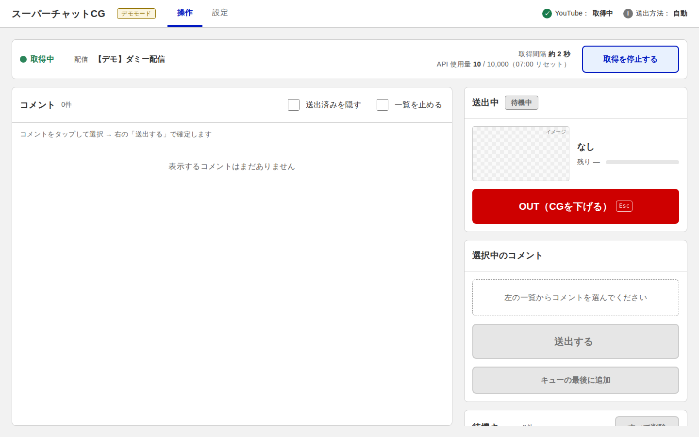

# スーパーチャットCG

YouTube Live のスーパーチャット（必要なら通常コメントも）をリアルタイムで取得し、Singular Live の CG に送出するローカル Web アプリです。



## 必要なもの

- Node.js 18 以上（追加パッケージのインストールは不要）
- Singular Live のコントロールアプリの App Token
- （取得方法を「YouTube Data API」にする場合のみ）YouTube Data API v3 の API Key

## Windows 版（exe）

[Releases](https://github.com/terai-takehiro/superchat_cg/releases) から `superchat-cg-windows-*.zip` をダウンロードし、展開した `superchat-cg.exe` をダブルクリックすると起動します（Node.js 不要）。ブラウザで操作画面が自動で開き、コマンドプロンプトは出さずにタスクトレイに常駐します（終了はトレイアイコンの右クリック →「終了」）。設定とログ（`superchat-cg.log`）は exe と同じフォルダに保存されます。

- exe は `npm run build:exe` で作成できます（実行した OS 用の実行ファイルが `dist/` にできます）。
- main にマージされると、GitHub Actions が Windows 用 exe をビルドし、`package.json` のバージョン（例：`v1.0.0`）でリリースを作成します。新しいリリースを出すときは `version` を上げてからマージしてください。

## 起動（Node.js から）

```sh
node server.js                # http://localhost:3000/
node server.js --port 3001    # ポート番号を指定（他のアプリと重なる場合）
node server.js --demo         # YouTube / Singular に接続せず、ダミーデータで動作確認
```

- Windows は `start.bat`、Mac は `start.command` をダブルクリックしても起動できます（ポート番号はファイル内の `3000` を書き換え）。
- ポート番号は設定画面でも変更できます（再起動後に反映）。起動時の `--port` が優先されます。
- 指定したポートが使用中の場合は、その旨と代わりの起動例を表示して終了します。
- タブレットなど別の端末から操作するときは、設定画面の「操作できる端末」を「同じネットワークの端末」にするか、`--host 0.0.0.0` で起動します。

## 使い方

1. **設定画面**（`/settings`）で API Key・配信 URL・App Token・サブコンポジション名・フィールド ID を入力して保存します。
   - 「保存して接続テスト」「保存してテストデータを送出」で Singular 側の動作を確認できます。
2. **操作画面**（`/`）で「取得を開始する」を押します。
3. 送出
   - **自動**：スパチャが届くと待機キューに入り、順番に In → 表示時間後に Out されます。
   - **手動**：コメントをタップして選び、「送出する」で確定します（誤操作防止のため 2 段階）。
   - 「OUT」（`Esc`）で CG を下げ、「キューの先頭を送出」（`N`）で次を出します。

## 設定項目

| 項目 | 内容 |
|---|---|
| 取得するコメント | スパチャのみ（スーパーステッカー含む）／全コメント |
| 取得間隔の決め方 | 自動（1日の上限に合わせて調整）／固定（秒数指定） |
| 1日の上限 | Google Cloud Console の割り当て値（既定 10,000） |
| フィールド ID | 名前・金額・コメント・アイコン画像 URL・金額帯の色を、Singular のどのフィールドに入れるか |
| 送出方法 | 自動／手動 |
| 表示時間 | 1 件の表示秒数（0 で OUT を押すまで表示） |
| 次の送出までの間隔 | OUT アニメーションの待ち時間 |

設定は `config.json` に保存されます（git 管理外）。API Key と Token は画面には再表示されません。

## 金額帯の色

YouTube のスーパーチャットと同じ配色です（日本円は金額、その他の通貨は YouTube API の tier で判定）。

| 金額 | 色 |
|---|---|
| ¥100〜 | `#1565C0` |
| ¥200〜 | `#00B8D4` |
| ¥500〜 | `#00BFA5` |
| ¥1,000〜 | `#FFB300` |
| ¥2,000〜 | `#E65100` |
| ¥5,000〜 | `#C2185B` |
| ¥10,000〜 | `#D00000` |

## コメントの取得方法

| 取得方法 | 特徴 |
|---|---|
| **YouTube から直接**（既定） | ブラウザのチャット欄と同じ仕組みで取得。API Key 不要・1日の上限なし・遅れは数秒で、長時間配信向け。YouTube の公式 API ではないため、YouTube 側の仕様変更で動かなくなる可能性があります |
| YouTube Data API | Google の公式 API。API Key が必要で、1日の使用上限があります（下記） |

「直接」で取得できなくなった場合は、設定画面で「YouTube Data API」に切り替えてください。

## YouTube Data API の上限

YouTube Data API には 1 日の使用上限（既定 10,000 ユニット）があり、コメント取得 1 回で 5 ユニット使います（「スパチャのみ」でも同じ）。上限は日本時間 16 時（冬時間は 17 時）にリセットされます。

- 取得間隔「自動」（既定）では、次のリセットまでに残りのユニットを使い切らないよう間隔を均等に割り振ります。既定の上限だと **約 44 秒ごと** の取得になります。
- 上限に達した場合はリセットまで休止し、自動で再開します。通信エラーも再試行し続けます。
- 使用量・取得間隔・リセット時刻は操作画面の上部に表示されます（このアプリが使った分のみ。同じ Google Cloud プロジェクトを他で使うと実際の残りは少なくなります）。
- **27 時間配信などで反映を速くしたい場合は、事前に Google へ上限の引き上げを申請してください**（YouTube API の「割り当て拡張」申請。審査に日数がかかります）。例えば 100,000 ユニットなら約 5 秒ごとに取得できます。申請が通ったら設定画面の「1日の上限」を合わせて変更してください。

## 長時間運用（27時間配信など）への備え

- 取得中に配信やネットワークが途切れても、「取得を停止する」を押すまでは 30 秒ごとに自動で再接続します（操作画面に「再接続中」と表示）。再接続時は途切れていた間のコメントも取り込み、取り込み済みのものは除外します。
- アプリが落ちたり再起動したりしても、前回取得中だった場合は起動時に自動で取得を再開します（`state.json` に保存）。
- 想定外のエラーが起きてもサーバーは止まらず、ログに記録して動作を続けます。

## 注意

- Singular への送出に失敗すると、そのコメントをキューの先頭に戻して自動送出を一時停止します。原因を直してから「キューの先頭を送出」を押すと再開します。
- 長時間の運用では、パソコンのスリープ・自動更新による再起動を無効にしてください。

## 構成

```
server.js          HTTP サーバー・API
lib/youtube-web.js YouTube ライブチャット取得（直接）
lib/youtube.js     YouTube ライブチャット取得（Data API）
lib/singular.js    Singular 送出キュー
lib/quota.js       API 使用量の記録（usage.json）
lib/demo.js        デモ用ダミーコメント
lib/config.js      設定の読み書き
public/            操作画面・設定画面
start.bat / start.command  ダブルクリック起動用
scripts/build-exe.js       exe の作成
.github/workflows/         Windows 版のビルドとリリース
mockup/            UI モックアップ（参考）
```
